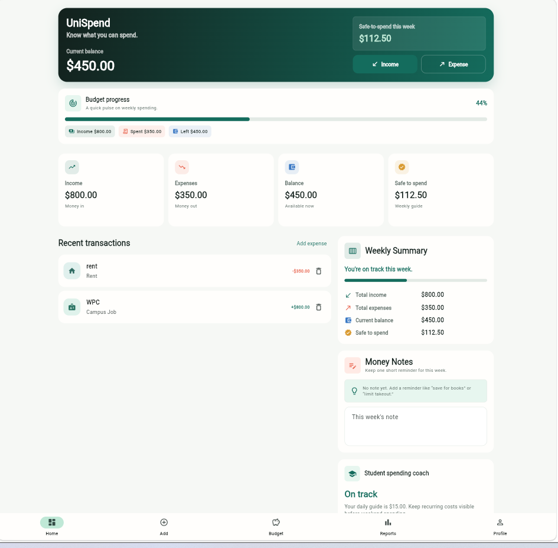
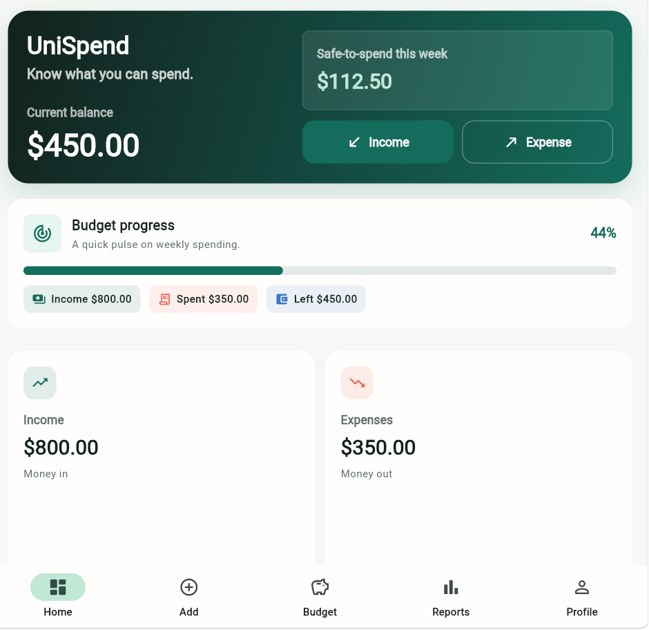

# UniSpend

UniSpend is a cross-platform Flutter finance app designed for students to track income, expenses, budgets, and money notes in one simple dashboard.

## Live Demo

[[Open UniSpend](https://unispend-student.netlify.app/)]

## Screenshots

### Home Dashboard



### Empty Dashboard



## Features

* Track income and expenses
* Student-friendly transaction categories
* Budget progress overview
* Weekly spending summary
* Money Notes for quick reminders
* Local data persistence
* Responsive layout for web and mobile screens
* Deployed online with Netlify

## Tech Stack

* Flutter
* Dart
* Local storage
* Netlify for web deployment

## Run Locally

Clone the project and run:

```bash
flutter pub get
flutter run -d chrome
```

## Build for Web

```bash
flutter build web
```

The web build will be generated inside:

```bash
build/web
```

## Current Status

The UniSpend web app is deployed online through Netlify. Android APK release is planned for a future update after fixing the Android Gradle build issue.

## Future Improvements

* Android APK release
* Firebase/cloud sync
* User login
* Export spending reports
* More analytics and charts
* Custom budget goals
